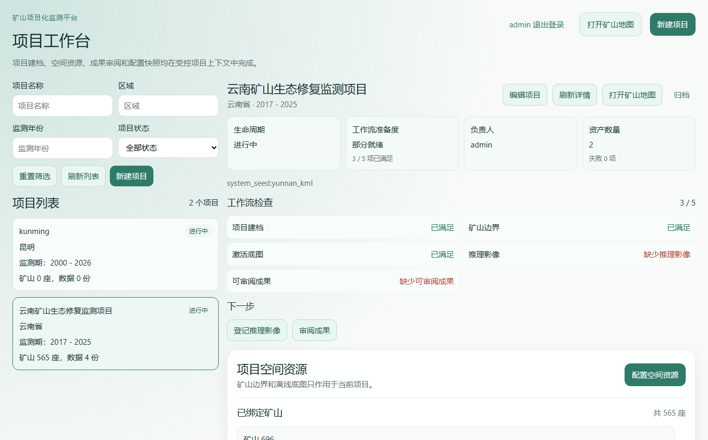
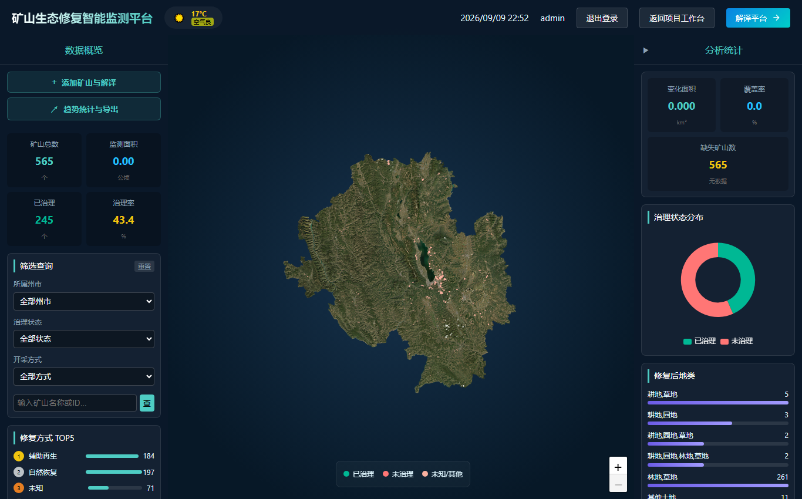
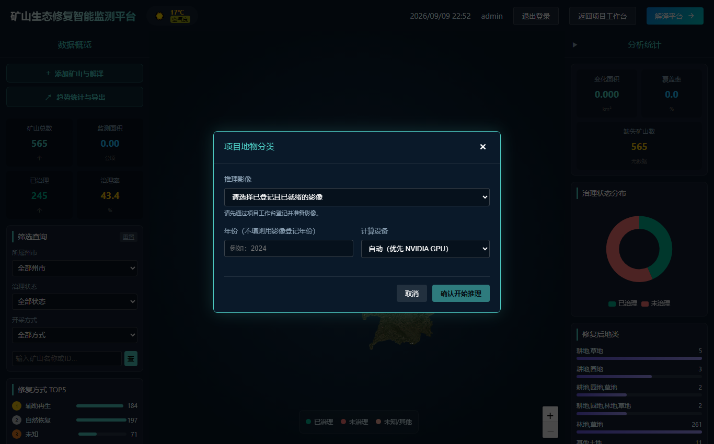

# YunNan 矿山生态修复遥感解译系统

基于卫星遥感影像的矿山生态修复监测与地物分类系统：项目建档 → 离线影像登记 → GPU/CPU 推理 → 矢量成果 → 人工修订 → 台账导出，全程按项目隔离、可追溯。

开发或修改前请先阅读项目级 [AGENTS.md](./AGENTS.md)。项目的模块边界、状态模型和低耦合契约见 [docs/architecture/project-structure-and-low-coupling-contract-v1.md](docs/architecture/project-structure-and-low-coupling-contract-v1.md)。

新人从 [开发规范](docs/development-standard.md) 和 [协作手册](docs/agent-collaboration-guide.md) 开始：前者说明模块、性能目标、测试和 PR 要求，后者提供职责与优先级、任务卡、Git/Docker/Agent/测试技能树、工具使用和交接示例。[agent.md](agent.md) 是其他 Agent 的手动接手入口。

## 界面预览

**项目工作台**——项目档案、工作流检查（5 项）与下一步动作引导：

**矿山地图**——离线底图瓦片 + 矿山边界 + 治理统计与趋势：

**地物分类推理**——选择已登记影像，GPU 优先/CPU 自动回退：

## 核心功能

- **项目工作台**：项目建档/归档、工作流准备度检查、下一步动作引导、八类公开资产目录、机器可读活动审计
- **空间资源**：矿山边界导入（KML/GeoJSON，FID 校验）、离线底图登记与自动切片（2.6GB 跨投影大图实测 108 秒）
- **智能推理**：受控影像登记后一键发起（tif/tiff/img/jp2），GPU 优先/CPU 自动回退，可选瓦片批量前向（`INFERENCE_BATCH_SIZE`），逐阶段计时随任务落库
- **成果体系**：分类成果矢量化、GeoView 人工修订（乐观锁 + 编辑审计）、GEOJSON/CSV/SHP 导出、台账 Excel 导出（含推理耗时列）
- **安全边界**：影像登记走受控 storage_key、路径防遍历、会话鉴权、导出仅写入项目受控目录（附清单与校验值）

## 目录结构

- `backend`：Flask 后端——项目领域、空间服务、推理调度、分类成果与导出
- `miner`：项目工作台（Vue 3）与 Node/Express 同源 BFF
- `frontend`：既有 Vue GeoView 解译前端（含分类成果矢量编辑器）
- `docker`：容器入口脚本、离线镜像构建与运行脚本
- `docs`：部署指南、架构契约、开发规范、测试方法手册、性能规划与实施计划
- `tests/fixtures`：项目概览与资产接口的契约黄金样例（后端与 BFF 测试共用）

## 快速开始

- **离线部署（推荐）**：见 [docs/offline_deployment_guide.md](docs/offline_deployment_guide.md)；Windows 完整迁移使用 `deploy_offline.ps1`（先 `-ValidateOnly` 预检）。GPU 推理需宿主机 NVIDIA 驱动，启动时叠加 `-f docker-compose.gpu.yml`。
- **开发验证**：后端 unittest 需固定 Python 3.10/GDAL 环境或运行镜像（可用命令见 [docs/development-standard.md](docs/development-standard.md) 第 7 节）；miner 在 `miner/` 下执行 `node --test` 与 `npm run build`。

## 不纳入版本库的运行资产

模型权重、原始影像、项目数据（`project_storage/`）、推理输出、离线镜像、Docker 卷及本地密钥（`.env`）均由 .gitignore 排除。部署时按 docs 中的离线部署说明放置对应资产，不要将其提交到仓库。
