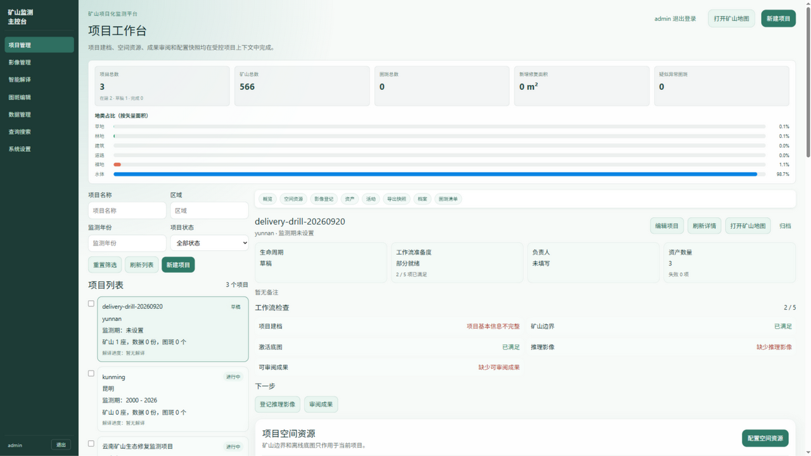
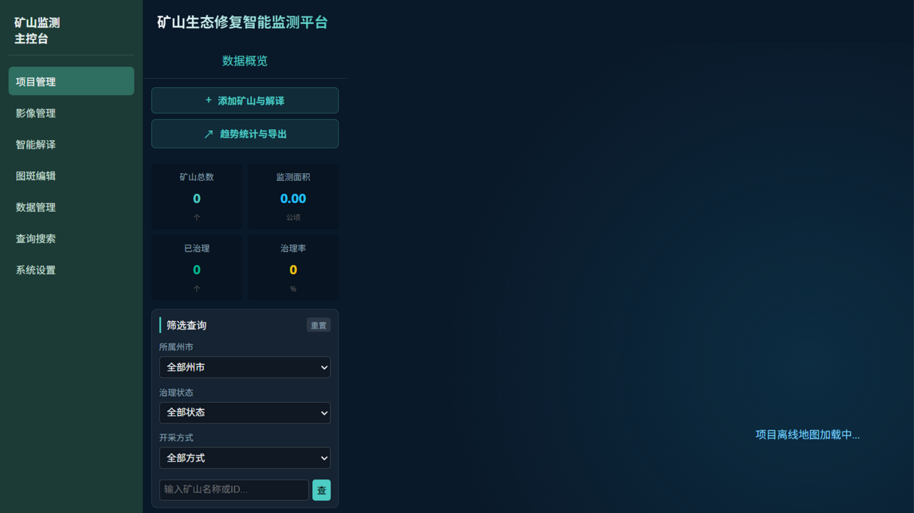
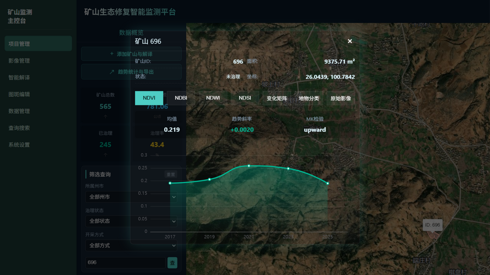
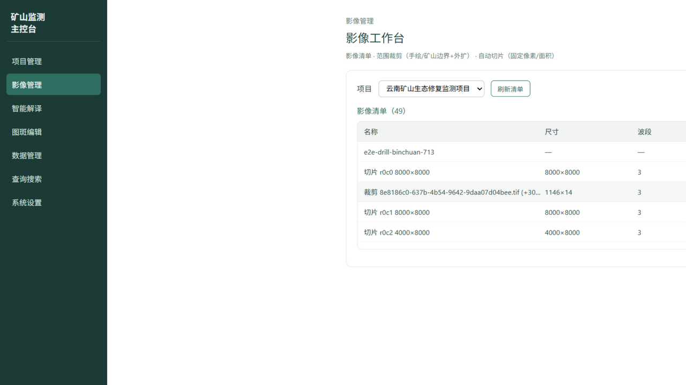
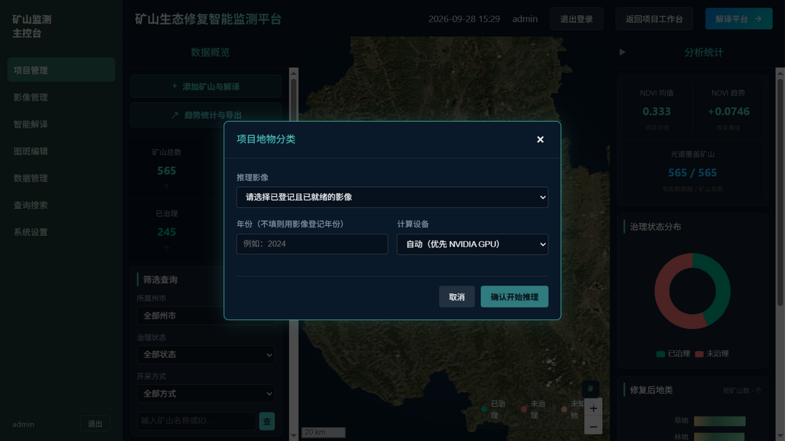
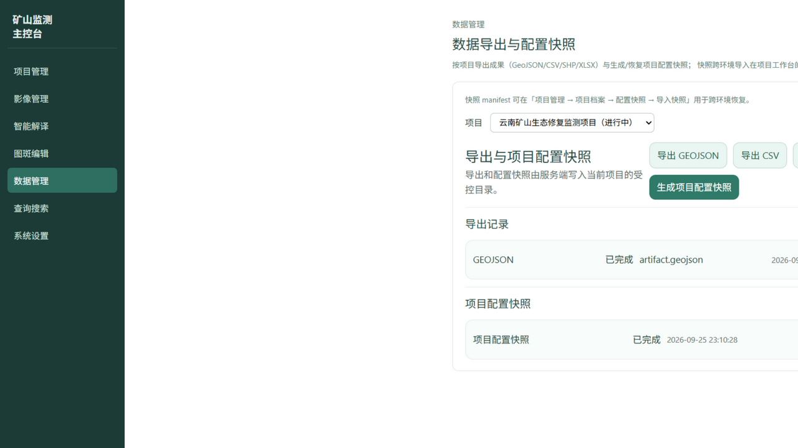
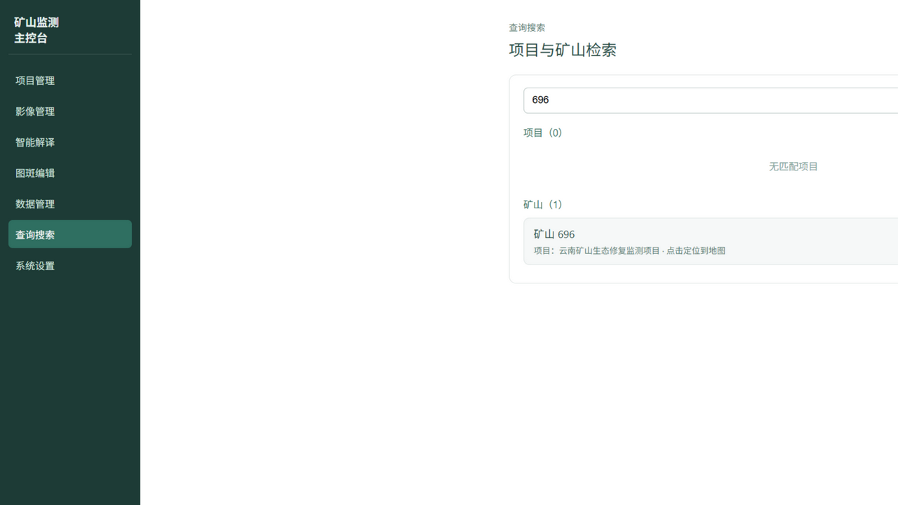
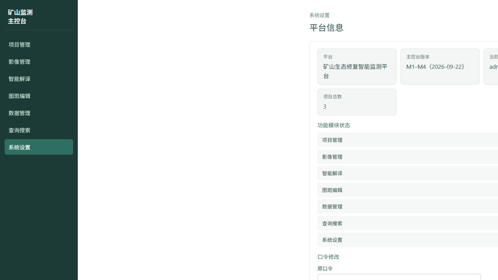

# YunNan 矿山生态修复遥感解译系统

基于卫星遥感影像的矿山生态修复监测与地物分类系统：项目建档 → 离线影像登记 → GPU/CPU 推理 → 矢量成果 → 人工修订 → 台账导出，全程按项目隔离、可追溯。

主控台七模块（项目管理 / 影像管理 / 智能解译 / 图斑编辑 / 数据管理 / 查询搜索 / 系统设置）共享当前项目上下文：在工作台选定的项目自动同步到各功能模块，无需反复选择。

开发或修改前请先阅读项目级 [AGENTS.md](./AGENTS.md)。项目的模块边界、状态模型和低耦合契约见 [docs/architecture/project-structure-and-low-coupling-contract-v1.md](docs/architecture/project-structure-and-low-coupling-contract-v1.md)。

新人从 [开发规范](docs/development-standard.md) 和 [协作手册](docs/agent-collaboration-guide.md) 开始：前者说明模块、性能目标、测试和 PR 要求，后者提供职责与优先级、任务卡、Git/Docker/Agent/测试技能树、工具使用和交接示例。[agent.md](agent.md) 是其他 Agent 的手动接手入口。

## 界面与主要功能（截图均为真实运行系统截取）

### 登录

管理员口令登录；口令可在系统设置自助修改（重启以服务器 `.env` 为准）。

### 项目工作台

项目档案、五项工作流准备度检查（项目建档 / 矿山边界 / 激活底图 / 推理影像 / 可审阅成果）与下一步动作引导；详情面板顶部提供八段锚点导航，大项目下不必长距离滚动。

### 矿山地图

离线底图瓦片（本项目为 z8–z15 本地金字塔，无需外网）+ 565 座矿山边界矢量；左侧数据概览与筛选（州市 / 治理状态 / 开采方式），右侧分析统计聚合 NDVI 均值、趋势与光谱覆盖。支持年份时序播放（2017→2025）回放修复演变。

### 矿山详情

点击（或搜索定位）任意矿山查看七维详情：NDVI / NDBI / NDWI / NDSI 四类光谱指数年际曲线与 MK 趋势检验、变化矩阵、地物分类溯源、原始影像。

### 影像管理

影像清单（31 份 GF-1 影像）与两类工具：范围裁剪（手绘多边形 / 矿山边界 + 外扩）、自动切片（固定像素 / 固定面积，边片丢弃）。影像来源只接受受控 `storage_key`，浏览器不提交服务器物理路径。

### 地物分类推理

从工作台「开始地物分类」发起：选择已就绪影像，GPU 优先 / CPU 自动回退，可选瓦片批量前向（`INFERENCE_BATCH_SIZE`），逐阶段计时随任务落库。

### 数据管理

按项目导出 GEOJSON / CSV / SHP / XLSX / DXF 成果与台账（台账时间为北京时间）；生成项目配置快照（manifest 含校验值），支持下载与恢复；跨环境导入在项目档案面板完成。所有时间戳统一 UTC 序列化、本地正确换算显示。

### 查询搜索

项目名称 / 区域 / 矿山 ID 一框检索，矿山 ID 跨项目定位并可跳转地图。

### 系统设置

平台信息、七模块功能状态与管理员口令修改（含重启覆盖运维提示）。

## 核心能力一览

- **项目工作台**：项目建档/归档/批量操作、工作流准备度（readiness 与生命周期分离，AGENTS §4）、八类公开资产目录（`ProjectAssetView`）、机器可读活动审计（`action_code` 持久化 + 界面中文本地化）
- **空间资源**：矿山边界导入（KML/GeoJSON，FID 校验与字段映射）、离线底图登记与自动切片（2.6GB 跨投影大图实测 108 秒）、历史底图保留与重新激活
- **智能推理**：受控影像登记后一键发起（tif/tiff/img/jp2），GPU 优先/CPU 自动回退；光谱指数（NDVI/NDBI/NDWI/NDSI）逐矿计算与项目级聚合
- **成果体系**：分类成果矢量化、GeoView 人工修订（乐观锁 + 编辑审计）、四格式导出与台账 Excel（含推理耗时列）、项目配置快照与恢复
- **安全边界**：影像登记走受控 storage_key、路径防遍历与项目沙箱前缀校验、会话鉴权、导出仅写入项目受控目录（附清单与校验值）

## 目录结构

- `backend`：Flask 后端——项目领域、空间服务、推理调度、光谱指数、分类成果与导出
- `miner`：项目工作台（Vue 3）与 Node/Express 同源 BFF（`miner/src` 前端、`miner/routes`+`miner/services` 转发层）
- `frontend`：既有 Vue GeoView 解译前端（含分类成果矢量编辑器）
- `docker`：容器入口脚本、离线镜像构建与运行脚本
- `docs`：部署指南、架构契约、开发规范、测试方法手册、性能规划与实施计划
- `tests/fixtures`：项目概览与资产接口的契约黄金样例（后端与 BFF 测试共用）

## 快速开始

- **离线部署（推荐）**：见 [docs/offline_deployment_guide.md](docs/offline_deployment_guide.md)；Windows 完整迁移使用 `deploy_offline.ps1`（先 `-ValidateOnly` 预检）。GPU 推理需宿主机 NVIDIA 驱动，启动时叠加 `-f docker-compose.gpu.yml`。
- **开发验证**：后端 unittest 需固定 Python 3.10/GDAL 环境或运行镜像（可用命令见 [docs/development-standard.md](docs/development-standard.md) 第 7 节）；miner 在 `miner/` 下执行 `node --test` 与 `npm run build`。

## 不纳入版本库的运行资产

模型权重、原始影像、项目数据（`project_storage/`）、推理输出、离线镜像、Docker 卷及本地密钥（`.env`）均由 .gitignore 排除。部署时按 docs 中的离线部署说明放置对应资产，不要将其提交到仓库。
